# Rese（リーズ）

グループ会社の飲食店予約サービス

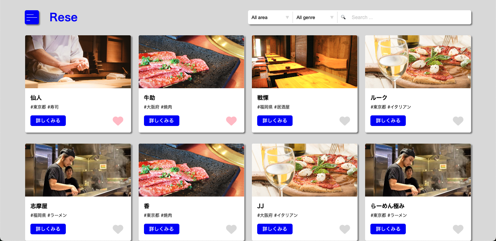

## 概要説明

外部の飲食店予約サービスは手数料を取られるので自社で予約サービスを持ちたい

## 環境構築

**Docker ビルド**

1. リポジトリをクローンする

```bash
`git clone git@github.com:minako-1221/reservation-system.git`
```

2. DockerDesktop アプリを立ち上げる
3. Docker コンテナをビルド

```bash
`docker-compose up -d --build`
```

**Laravel 環境構築**

1. PHP コンテナに入る

```bash
docker-compose exec php bash
```

2. Composer で必要なパッケージをインストール

```bash
composer install
```

3. `.env`ファイルを作成

```bash
cp .env.example .env
```

4. `.env`ファイルに以下の環境変数を追加

```text
DB_CONNECTION=mysql
DB_HOST=mysql
DB_PORT=3306
DB_DATABASE=laravel_db
DB_USERNAME=laravel_user
DB_PASSWORD=laravel_pass
```

5. アプリケーションキーの作成

```bash
php artisan key:generate
```

6. マイグレーションの実行

```bash
php artisan migrate
```

## 使用技術（実行環境）

- PHP:8.3.13
- Laravel:8.83.27
- Composer:2.8.0
- MySQL:8.0.26
- Nginx:1.21.1

## ER 図

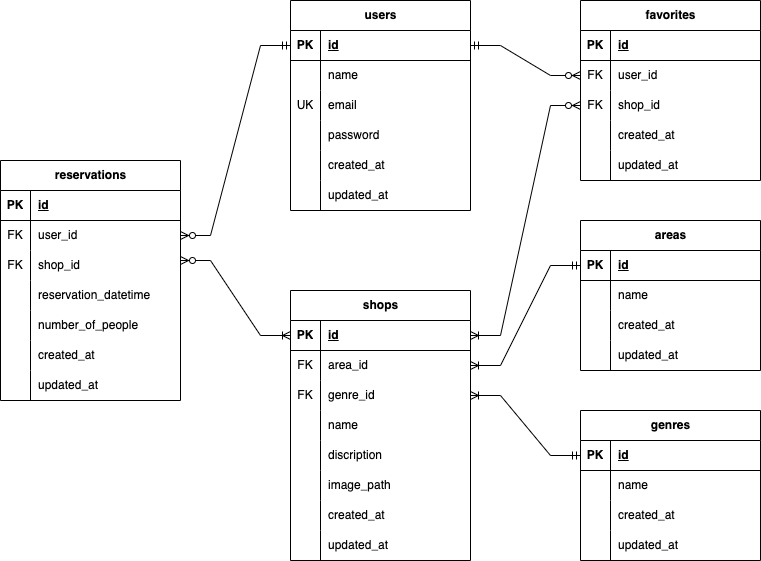

## URL

- 開発環境：http://localhost/
- phpMyAdmin:http://localhost:8080/

## 使用方法

### ヘッダー

1. ハンバーガーアイコンとシステム名が表示される
2. ハンバーガーアイコンをクリックするとメニューが表示される
- 未ログイン状態では「Home、Registration、Login」

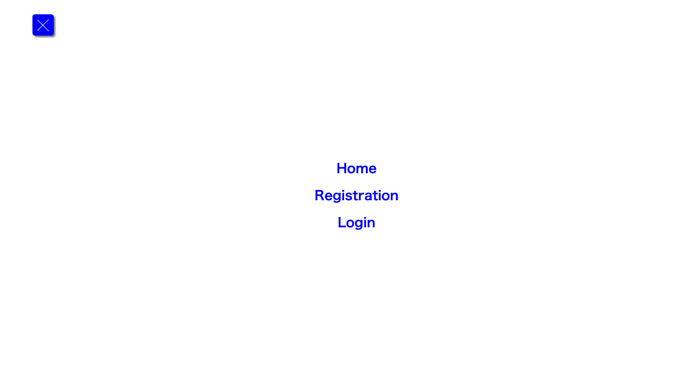

- ログイン状態では「Home、Logout、Mypage」

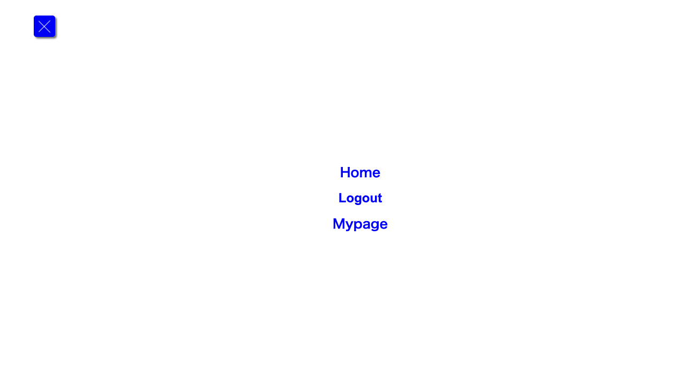


### 会員登録

1. 会員登録画面にアクセスする

```bash
http://localhost/register
```

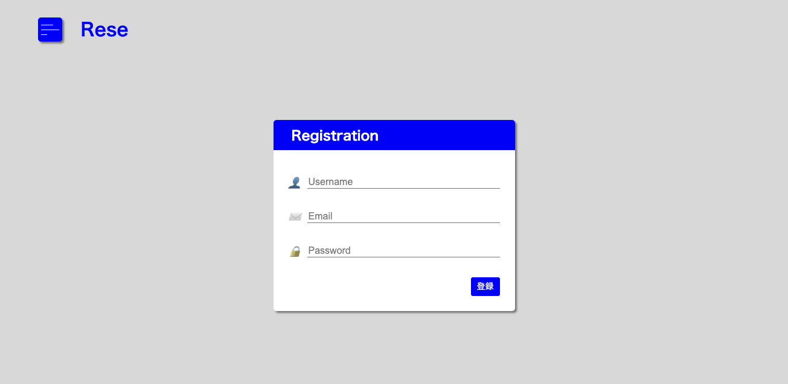

2. 必要な情報（名前、メールアドレス、パスワード）を入力する
3. 「登録」ボタンを押す
4. 登録が完了するとサンクスページが表示される

```bash
http://localhost/thanks
```

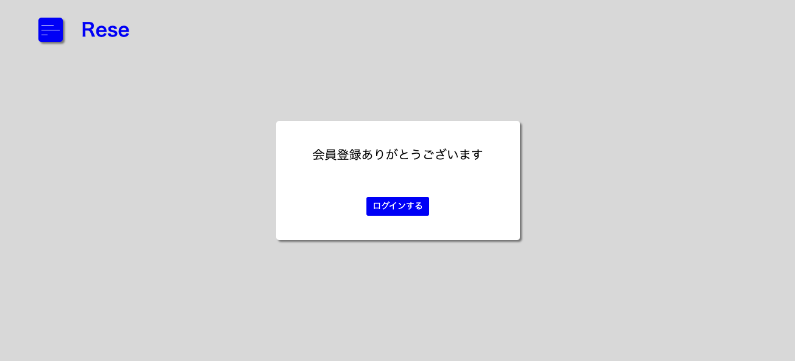

5. サンクスページの「ログインする」ボタンを押すとログイン画面にリダイレクトされる


### ログイン

1. ログイン画面にアクセスする

```bash
http://localhost/login
```

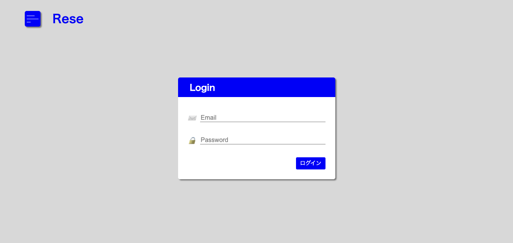

2. 登録したメールアドレスとパスワードを入力する
3. 「ログイン」ボタンを押す
4. ログインに成功するとホーム画面にリダイレクトされる


### ホーム画面

1. ホーム画面にアクセスする、またはログイン後にリダイレクトされる

```bash
http://localhost/
```


**店舗一覧表示**

1. カード形式で店舗一覧が表示される

**検索機能**

1. エリア、ジャンルは選択式で検索可能
2. 店舗名は部分一致、完全一致で検索可能

**お気に入り機能**

1. カード右下にグレーの♡ボタンを配置
2. 「♡」ボタンを押すと色がピンクに替わり、お気に入り追加
3. 再度押すとグレーに戻り、お気に入り削除


### 店舗詳細ページ

1. 店舗一覧の「詳しくみる」ボタンを押して、店舗詳細画面にアクセスする

```bash
http://localhost/detail/{shop_id}
```

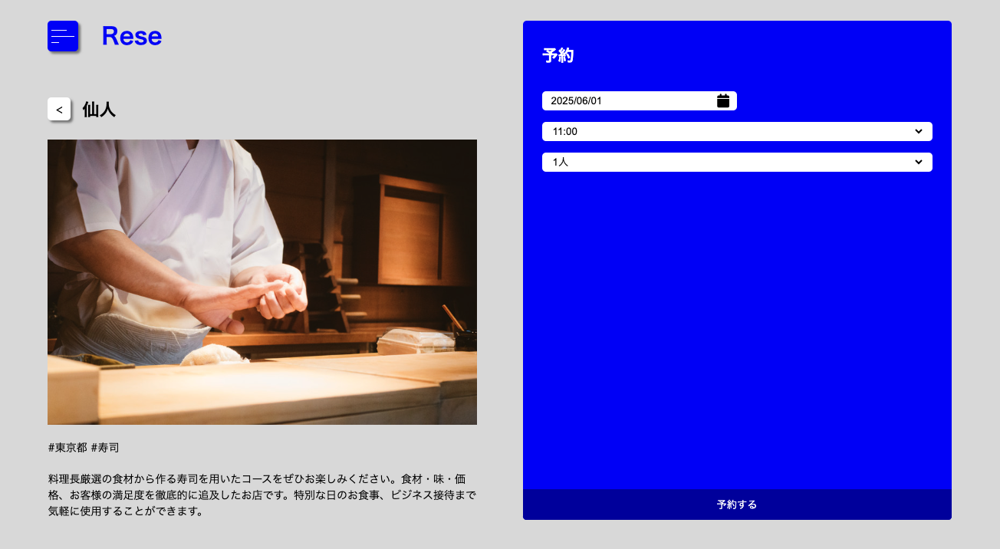

**店舗詳細表示**

1. 画面左側に表示（店舗名、画像、エリア、ジャンル、店舗説明）

**予約機能**

1. 画面右側に表示
2. 日付、時間、人数を選択して「予約する」ボタンを押す
3. 予約が完了すると予約完了ページが表示される

```bash
http://localhost/done
```

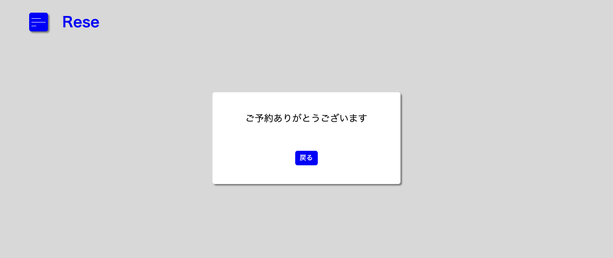

4. 「戻る」ボタンを押すと店舗詳細ページにリダイレクトされ、予約フォーム内に予約リストが追加される

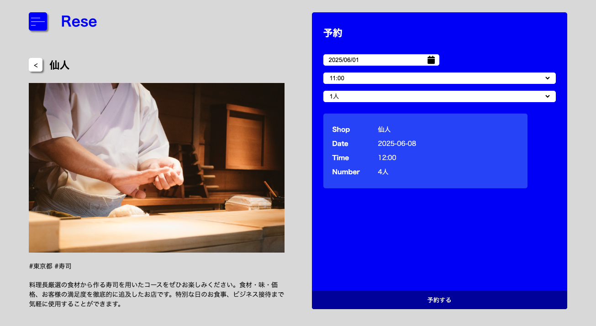


### マイページ

1. メニューから「Mypage」を押して、マイページにアクセスする

```bash
http://localhost/mypage
```

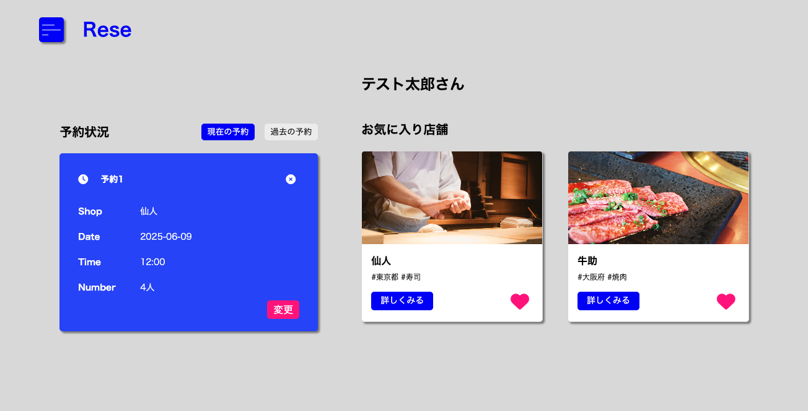

**予約状況**

1. 画面左側に表示
2. ログインユーザーに紐づく有効な予約が表示される
3. 予約状況タイトル右側の「過去の予約」ボタンを押すと、過去の予約が表示される

**予約削除機能**

1. 予約リスト右上の × 印を押すと、予約削除の確認画面が表示される
2. 「はい」をクリックすると予約が削除される

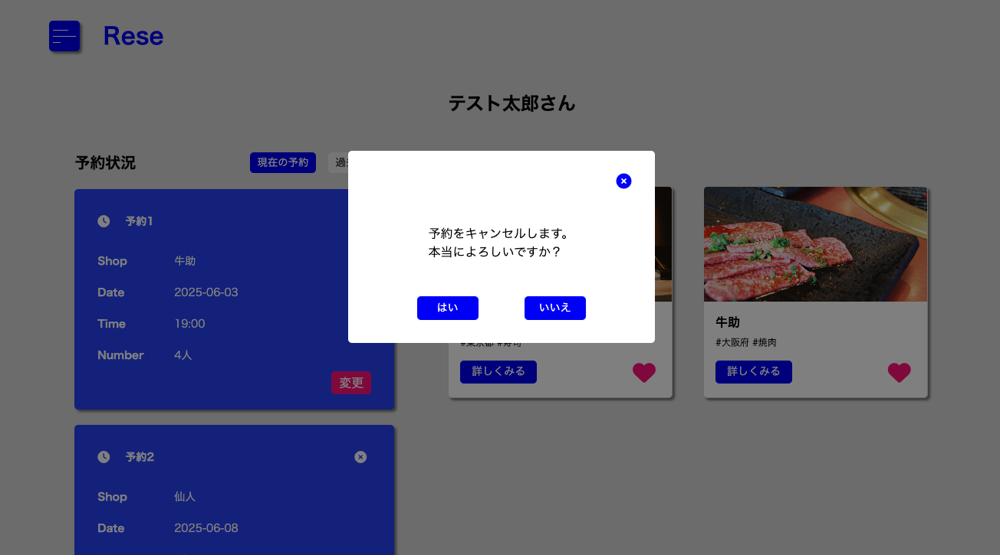

**予約変更機能**

1. 現在の予約リスト右下の「変更」ボタンを押すと、予約変更フォームが表示される

```bash
http://localhost/reservations/{id}/change
```

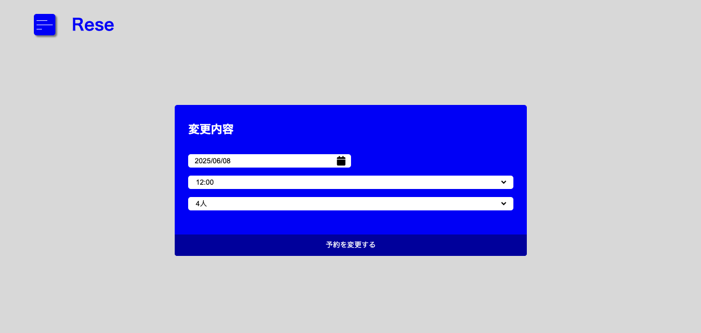

2. 変更内容を入力し、「予約を変更する」ボタンをクリックすると予約変更完了画面が表示される

```bash
http://localhost/reservations/{id}/change
```

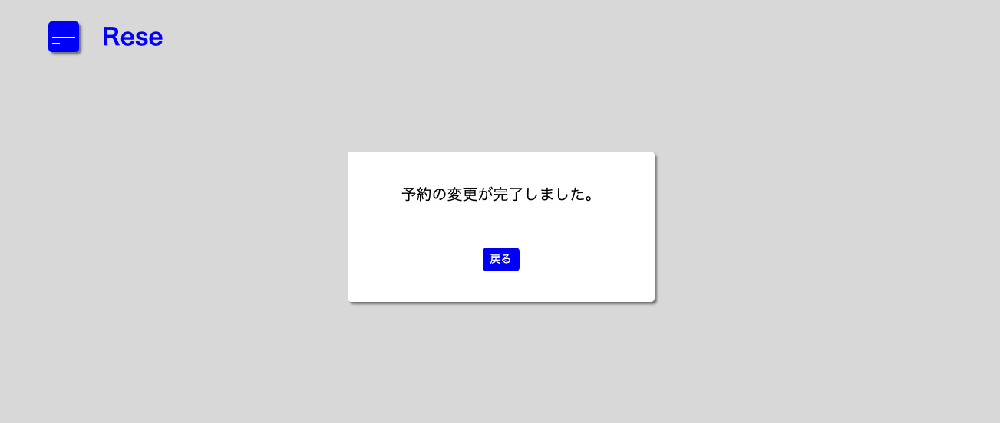

3. 「戻る」ボタンを押すとマイページにリダイレクトされる

**レビュー機能**

1. 「過去の予約」を押して過去の予約を表示

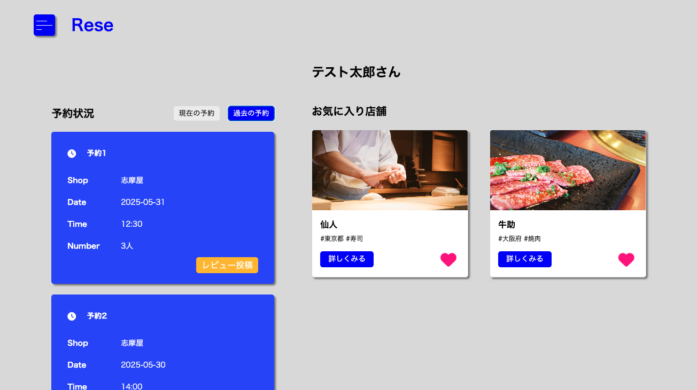

2. 予約リスト右下の「レビュー投稿」ボタンを押すと、レビュー投稿画面にアクセスする

```bash
http://localhost/reviews/{reservation}/create
```

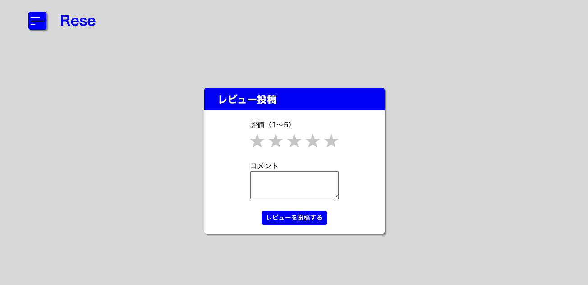

3. 星の数を１〜５で選択、コメントを入力して「レビューを投稿する」ボタンを押す

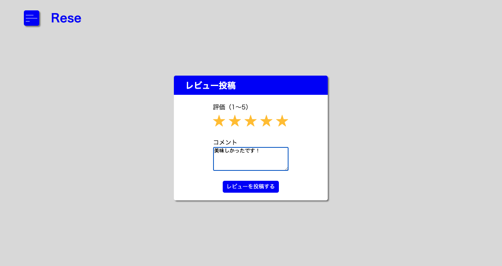

4. レビュー投稿済みの予約リストにはレビュー内容が追加され、「レビュー投稿」ボタンが「投稿済み」になり押せなくなる

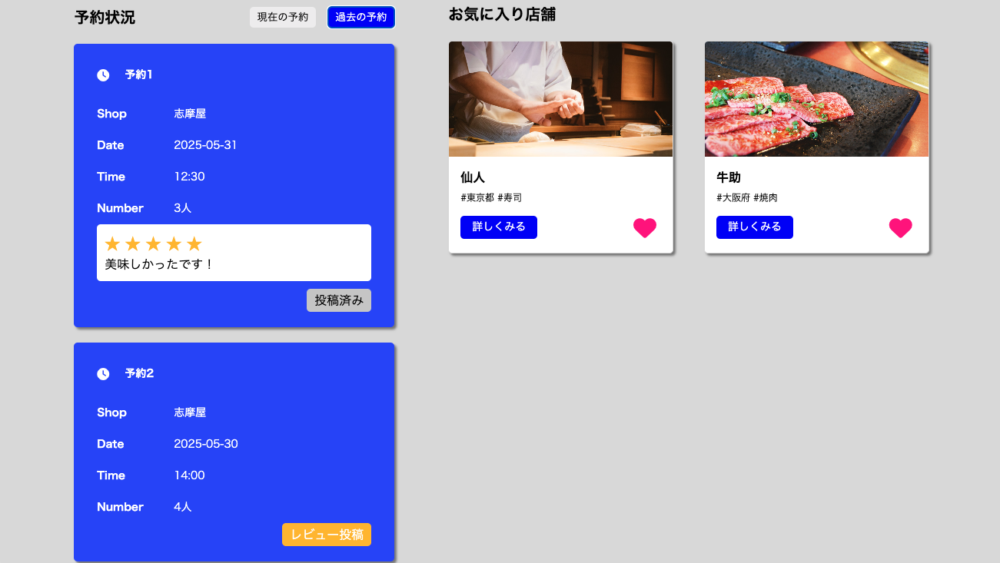

**お気に入り店舗**

1. 画面右側にログインユーザーと紐づくお気に入り店舗のリストを表示
2. 「♡」ボタンを押すとお気に入り登録解除


### ログアウト

1. メニューから「logout」を押す
2. ログアウト後はログイン画面にリダイレクトされる


### 注意事項

**ログインしていない時**

- ホーム画面のカード右下の「♡」ボタンは非表示
- 店舗詳細画面右側の予約機能内、「予約する」ボタンは無効
